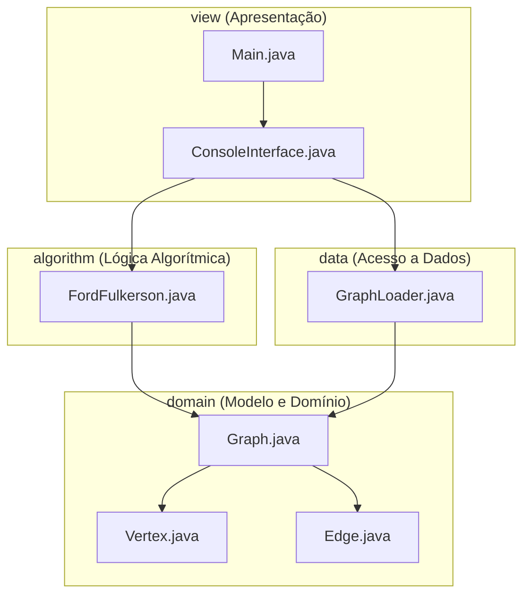

<style>
body {
text-align: justify}
</style>

---

# Seção 01 - Especificação do Problema

## 1.1 Descrição do Problema
O problema selecionado consiste na **Otimização de Infraestrutura e Gerenciamento de Banda em Provedores de Internet (ISPs) para Distribuição de Streaming**. Com o crescimento exponencial da demanda por streaming de vídeo sob demanda e transmissões ao vivo de alta definição, os ISPs enfrentam constantes desafios técnicos para rotear e alocar o tráfego de dados de forma eficiente. O tráfego deve trafegar de seus servidores centrais (origem) até os usuários e áreas de consumo finais (destino) utilizando a infraestrutura física de rede disponível de forma otimizada.

A infraestrutura de rede é modelada matematicamente como um grafo direcionado e ponderado de fluxo, onde:
* **Servidores de Origem (Fontes):** Representam os data centers ou pontos de fornecimento de conteúdo de streaming.
* **Roteadores Intermediários:** São os nós de rede (roteadores centrais ou de borda) responsáveis por encaminhar os pacotes de dados.
* **Áreas de Clientes Finais (Sumidouros):** São as sub-redes ou regiões de consumo final onde os usuários acessam o streaming.
* **Links de Fibra Óptica (Arestas):** São os cabos físicos que conectam os diferentes nós, onde o peso da aresta representa a sua capacidade máxima de banda passante (capacidade limite de tráfego de dados medida em Mbps ou Gbps).

O objetivo do aplicativo é determinar a rota ideal e a distribuição exata de tráfego por cada link físico da rede, maximizando a taxa de transferência total de dados do servidor até os clientes, respeitando estritamente duas restrições clássicas de redes de fluxo:
1. **Restrição de Capacidade:** O fluxo/tráfego de dados alocado em cada link de fibra óptica não pode exceder sua capacidade máxima nominal.
2. **Restrição de Conservação de Fluxo:** A taxa de dados que entra em qualquer roteador intermediário deve ser exatamente igual à taxa que sai dele. Não deve ocorrer acúmulo de tráfego nos roteadores intermediários nem perda de pacotes.

## 1.2 Algoritmo de Grafo Aplicado e Justificativa
Para a resolução do problema prático proposto, foi implementado o algoritmo clássico de **Ford-Fulkerson** para determinação de fluxo máximo.

A aplicabilidade do algoritmo baseia-se nos seguintes fatores estruturais:
* O servidor de streaming é modelado como a fonte única da rede de fluxo, possuindo capacidade de saída ilimitada.
* A área de clientes de destino é mapeada como o sumidouro final da rede, drenando todo o fluxo de transmissão.
* Cada link físico da rede possui uma capacidade de banda definida. O algoritmo analisa iterativamente caminhos aumentantes de fluxo da origem ao destino, calculando gargalos e construindo um grafo residual.
* O fluxo calculado em cada aresta pelo algoritmo indica exatamente a banda física (Mbps) que o ISP deve rotear por aquele link de fibra óptica.
* O valor final do fluxo máximo total encontrado pelo algoritmo representa a capacidade máxima de vazão de streaming que a rede consegue suportar de ponta a ponta sem congestionamentos.

Assim, o Ford-Fulkerson resolve perfeitamente a necessidade de otimização de banda de forma ótima e matematicamente comprovada.

---

# Seção 02
## 2.1 - Estrutura utilizada para representação do grafo

Para a implementação da biblioteca foi utilizada a representação por **lista de adjacência**. Nessa abordagem, cada vértice mantém uma lista contendo as arestas conectadas a ele.

A escolha dessa estrutura ocorreu por sua simplicidade de implementação e por utilizar memória apenas para as conexões existentes no grafo. Dessa forma, não é necessário armazenar todas as combinações possíveis entre vértices, como ocorreria em uma matriz de adjacência.

A estrutura principal do grafo foi implementada na classe `Graph<T>`.

```{java}
private List<Vertex<T>> vertices;
private Map<Vertex<T>, List<Edge<T>>> adjacencyList;
```

A lista `vertices` é responsável por armazenar todos os vértices do grafo, enquanto `adjacencyList` mantém as conexões existentes entre eles.

Os vértices são representados pela classe `Vertex<T>`, permitindo armazenar qualquer tipo de dado através do uso de generics.

```{java}
public class Vertex<T> {
    private T value;
}
```

Já as arestas são representadas pela classe `Edge<T>`, responsável por armazenar a origem, o destino e a capacidade associada à conexão.

```{java}
public class Edge<T> {

    private Vertex<T> origin;
    private Vertex<T> destination;
    private float capacity;

}
```

Essa estrutura serviu como base para a implementação dos algoritmos desenvolvidos ao longo do trabalho.

## 2.2 - Inserção de vértices
A inserção de vértices é realizada pelo método `addVertex()`. Antes da criação de um novo vértice, a implementação percorre a lista de vértices existentes para verificar se o valor informado já está presente no grafo.

```{java}
public void addVertex(T value) {

    for (Vertex<T> vertex : vertices) {
        if (vertex.getValue().equals(value)) {
            return;
        }
    }

    Vertex<T> vertex = new Vertex<>(value);

    vertices.add(vertex);
    adjacencyList.put(vertex, new ArrayList<>());
}
```

A verificação evita a criação de vértices duplicados e garante que cada valor esteja associado a apenas um vértice.

Como a implementação pode percorrer toda a lista de vértices no pior caso, sua complexidade é **O(V)**, onde **V** representa a quantidade de vértices do grafo.

## 2.3 - Inserção de arestas
A criação de conexões entre vértices é realizada pelo método `addEdge()`.

```{java}
public void addEdge(
        T origin,
        T destination,
        float capacity
) {
    ...
    adjacencyList.get(originVertex)
                 .add(
                     new Edge<>(
                         originVertex,
                         destinationVertex,
                         capacity
                     )
                 );
}
```

Inicialmente são localizados os vértices de origem e destino informados pelo usuário. Após a localização, uma nova aresta é criada e adicionada à lista de adjacência do vértice de origem.

Como a implementação precisa localizar os vértices antes de criar a aresta, a complexidade da operação é **O(V)** no pior caso.

## 2.4 - Busca em Largura (BFS)
Para realizar o caminhamento do grafo foi implementado o algoritmo de Busca em Largura (Breadth-First Search - BFS).
A implementação utiliza uma fila para controlar a ordem de visita dos vértices.

```{java}
Queue<Vertex<T>> queue = new LinkedList<>();
List<Vertex<T>> visited = new ArrayList<>();

queue.add(start);
visited.add(start);

while (!queue.isEmpty()) {

    Vertex<T> current = queue.poll();

    for (Edge<T> edge : adjacencyList.get(current)) {

        Vertex<T> neighbor =
                edge.getDestination();

        if (!visited.contains(neighbor)) {
            visited.add(neighbor);
            queue.add(neighbor);
        }
    }
}
```

O algoritmo visita inicialmente o vértice de origem e, em seguida, explora todos os seus vizinhos antes de avançar para os próximos níveis do grafo.

A utilização da lista de adjacência permite acessar diretamente os vértices conectados ao vértice atual, tornando a navegação eficiente.

Cada vértice é visitado apenas uma vez e cada aresta é analisada no máximo uma vez durante a execução. Dessa forma, a complexidade do algoritmo é **O(V + E)**, onde:

* V representa a quantidade de vértices;
* E representa a quantidade de arestas.


## 2.5 - Algoritmo de Fluxo Máximo (Ford-Fulkerson)
Para a resolução do problema prático foi implementado o algoritmo de Ford-Fulkerson em uma classe separada da biblioteca base.

A separação entre estrutura e algoritmo foi realizada para manter a biblioteca genérica e reutilizável, permitindo que outros algoritmos possam ser implementados futuramente sem alterações na estrutura do grafo.

O algoritmo é responsável por determinar o fluxo máximo que pode ser transportado entre uma origem e um destino respeitando a capacidade das arestas.

A busca por caminhos é realizada através de uma busca em profundidade (DFS).

```{java}
private boolean dfsPath(
        Graph<T> graph,
        Vertex<T> current,
        Vertex<T> sink,
        List<Edge<T>> path,
        List<Vertex<T>> visited
)
```

Após encontrar um caminho válido, é determinado o gargalo do percurso, correspondente à menor capacidade encontrada entre as arestas.

```{java}
float bottleneck = Float.MAX_VALUE;

for (Edge<T> edge : path) {
    bottleneck = Math.min(
            bottleneck,
            edge.getCapacity()
    );
}
```
Em seguida, as capacidades são atualizadas e o fluxo encontrado é somado ao fluxo total da rede.

O processo continua até que não existam mais caminhos possíveis entre origem e destino.

Como a implementação realiza sucessivas buscas por caminhos aumentantes, sua complexidade é **O(E × F)**, onde:

* E representa a quantidade de arestas do grafo;
* F representa o valor do fluxo máximo encontrado.

Isso ocorre porque, a cada aumento de fluxo, é necessário percorrer arestas da rede para encontrar um novo caminho válido até que não seja mais possível aumentar o fluxo total.


# Seção 03 - Arquitetura do Sistema e Manual de Uso

## 3.1 Arquitetura em Camadas
O aplicativo foi desenvolvido utilizando uma arquitetura em camadas bem estruturada, visando garantir a separação de responsabilidades (independência de representação de dados, de processamento e de interface).

A divisão do código-fonte em pacotes Java segue a seguinte estrutura conceitual:

*   **`domain` (Camada de Domínio):** Contém as classes que definem a estrutura matemática e genérica do grafo (`Vertex.java`, `Edge.java` e `Graph.java`). Estas classes não possuem dependência de interfaces ou de lógica de arquivos, e implementam operações puras de grafos, incluindo o construtor de cópia profunda para garantir a imutabilidade do grafo original no cálculo do fluxo.
*   **`data` (Camada de Dados):** Contém a classe `GraphLoader.java`, responsável pelo parser e carregamento de arquivos no formato de matriz de adjacência gerado pelo script do professor. Ela lê o arquivo, mapeia nomes e popula a lista de adjacências de forma bidirecional.
*   **`algorithm` (Camada de Algoritmo):** Contém a implementação da classe `FordFulkerson.java`. Executa a lógica de caminhos aumentantes e cálculo de fluxo máximo sobre uma cópia de trabalho da rede, retornando o fluxo total e o estado final do grafo de resíduos.
*   **`view` (Camada de Apresentação):** Contém o ponto de entrada `Main.java` e a interface de console CLI `ConsoleInterface.java`. Gerencia a interação interativa, validação de entradas do teclado, inicialização de menus e formatação do relatório de fluxos.



---

## 3.2 Manual de Uso do Aplicativo
O aplicativo funciona em modo de console de texto (CLI) por meio de um menu de opções numéricas. Siga as etapas abaixo para usá-lo:

### 1. Preparação da Topologia de Rede
*   Use a classe `GeradorArquivosGrafo` dentro do pacote `geradorarquivos` para gerar um arquivo de topologia aleatório. Por padrão, ele criará um arquivo chamado `entrada.txt` na raiz do projeto.

### 2. Inicialização do Sistema
*   Execute a classe `view.Main` no seu ambiente Java para abrir a interface no terminal.

### 3. Carregamento dos Dados
*   Selecione a **Opção 1** no menu.
*   O sistema perguntará pelo caminho do arquivo. Pressione **Enter** para usar o arquivo padrão `entrada.txt` ou informe o nome de outro arquivo.
*   O console informará quantos roteadores foram lidos com sucesso.

### 4. Visualização de Capacidades
*   Selecione a **Opção 2** para visualizar todos os roteadores carregados e os cabos de fibra conectados com suas respectivas capacidades de banda.

### 5. Edição Interativa da Rede (Opcional)
*   Para adicionar um novo roteador, use a **Opção 3** e insira o nome.
*   Para estabelecer um novo link físico de fibra bidirecional entre roteadores, use a **Opção 4** inserindo o nó de origem, destino e a capacidade em Mbps.

### 6. Execução da Otimização de Tráfego de Streaming
*   Selecione a **Opção 5**.
*   Digite o nome do **Servidor de Origem** (ex: `Mupot`) e o nome da **Área de Clientes de Destino** (ex: `Xer`).
*   O sistema processará o algoritmo de Ford-Fulkerson e exibirá no terminal a **Vazão de Streaming Máxima Total** suportada e detalhará quanto tráfego passará por cada link ativo da rede (ex: `[Link Fibra] Mupot -> Xer: 45.32 / 100.00 Mbps`).

### 7. Encerramento
*   Selecione a **Opção 6** para sair da aplicação de forma limpa.

---

# Seção 04
## 4.1  Responsabilidades atividades

| Atividade                                                    | Responsável                |
| ------------------------------------------------------------ | -------------------------- |
| Implementação da classe `Vertex`                             | Gabriel Leite Fonseca      |
| Implementação da classe `Edge`                               | Gabriel Leite Fonseca      |
| Implementação da classe `Graph`                              | Gabriel Leite Fonseca      |
| Implementação dos métodos de inserção de vértices e arestas  | Gabriel Leite Fonseca      |
| Implementação do algoritmo de Busca em Largura (BFS)         | Gabriel Leite Fonseca      |
| Elaboração da Seção 2 do relatório                           | Gabriel Leite Fonseca      |
| Implementação do algoritmo de Ford-Fulkerson                 | Gabriel Leite Fonseca      |
| Implementação do algoritmo de Ford-Fulkerson                 | César Augusto Bispo Santos |
| Desenvolvimento das funcionalidades específicas da aplicação | César Augusto Bispo Santos |
| Integração da biblioteca ao problema proposto                | César Augusto Bispo Santos |
| Elaboração das Seções 3, 4 e demais partes do relatório      | César Augusto Bispo Santos |
| Testes e validação da aplicação                              | César Augusto Bispo Santos |

## 4.2 Repositório do Projeto
github: https://github.com/Gabedf/TPA/tree/main/Graphs/

## 4.3 Utilização de Ferramentas de Inteligência Artificial
Durante o desenvolvimento do trabalho foram utilizadas ferramentas baseadas em Large Language Models (LLMs) como apoio à pesquisa, implementação e documentação do projeto.

Essas ferramentas foram empregadas para esclarecer dúvidas sobre conceitos de grafos, estruturas de dados da linguagem Java e possíveis abordagens de implementação. Também foram utilizadas para auxiliar na elaboração de trechos do relatório e na revisão de partes do código.

O desenvolvimento ocorreu de forma iterativa, utilizando as sugestões fornecidas como ponto de partida para discussão e implementação das soluções. Ao longo do processo foram realizados testes, correções e adaptações para adequar o código aos requisitos definidos pelo trabalho.