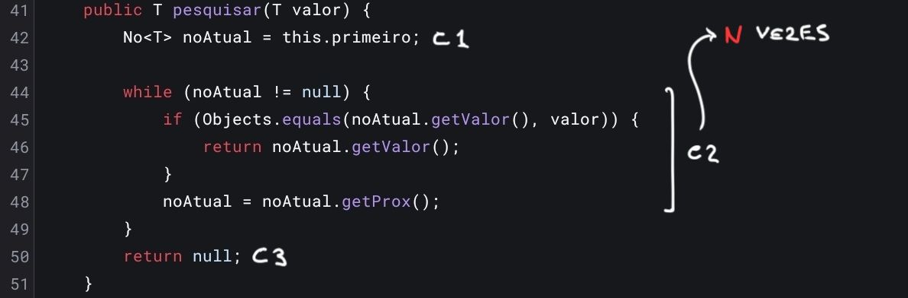
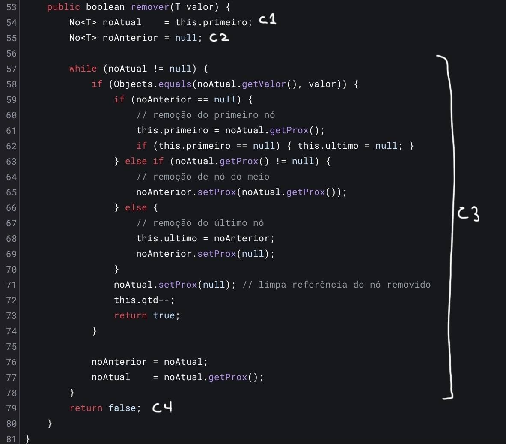
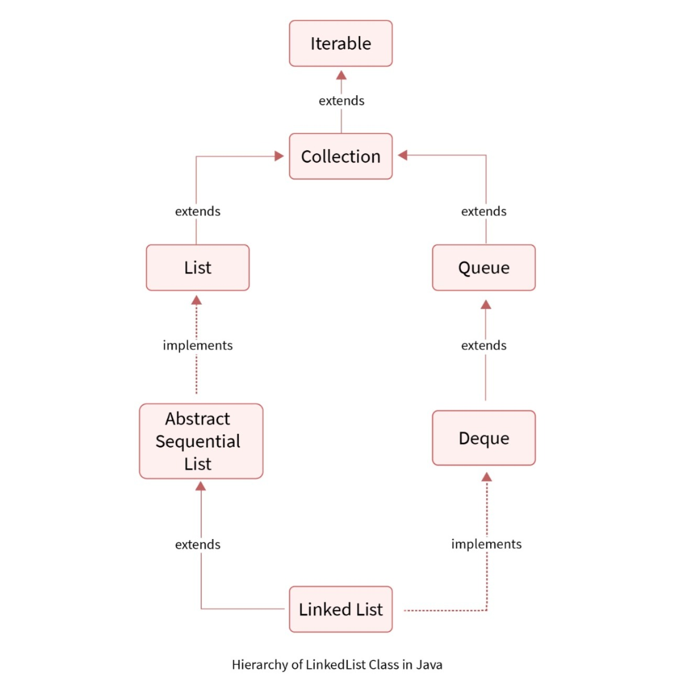

<style>
body {
text-align: justify}
</style>

---

# Seção 01


# Seção 02


# Seção 03

## 3.1 - Implementação

Para avaliar o desempenho prático da nossa implementação de estruturas de dados, desenvolvemos um módulo gerador de arquivos e um mecanismo de benchmark.

Os arquivos de entrada foram gerados utilizando a classe `GeradorDados`. Este módulo cria registros de alunos contendo uma matrícula (de forma sequencial, para garantir unicidade), um nome aleatório e uma nota. Todos os dados são gravados em arquivos `.txt` separados por ponto e vírgula (`;`). Abaixo, um trecho de código que consolida a geração:

```java
// Trecho do arquivo GeradorDados.java
Random random = new Random();
try (BufferedWriter writer = new BufferedWriter(new FileWriter(caminhoArquivo))) {
    for (int i = 1; i <= quantidade; i++) {
        int matricula = i;
        String nome = NOMES[random.nextInt(NOMES.length)] + " " + SOBRENOMES[random.nextInt(SOBRENOMES.length)];
        int nota = random.nextInt(11);
        
        writer.write(matricula + ";" + nome + ";" + nota);
        writer.newLine();
    }
}
```

A medição dos tempos de execução foi realizada com a classe `Benchmark`. Utilizamos `System.nanoTime()` para capturar o tempo imediatamente antes e após cada operação, isolando individualmente cada trecho medido. O benchmark foi executado **três vezes** de forma consecutiva dentro da mesma JVM, e os valores reportados nas tabelas correspondem à **média aritmética** das três execuções.

```java
// Trecho do arquivo Benchmark.java
long inicioCarga = System.nanoTime();
// ... (leitura sequencial do arquivo e uso da função .adicionar())
long tempoCarga = System.nanoTime() - inicioCarga;

long t0 = System.nanoTime();
lista.pesquisar(ultimoAluno);
long tempoBuscaExistente = System.nanoTime() - t0;
```

Para mitigar o efeito de *cold start* e o overhead da compilação JIT (Just-In-Time), uma passagem silenciosa de aquecimento (*warm-up*) é executada sobre o menor arquivo antes do início das medições. Ainda assim, existem limitações metodológicas que devem ser reconhecidas: o **tempo de carga** inclui tanto as inserções na lista quanto a leitura sequencial do arquivo em disco, de modo que esse resultado reflete um custo misto de I/O e estrutura de dados — não o custo isolado de `adicionar`. Além disso, fatores como o *Garbage Collector* da JVM, o escalonamento de processos do sistema operacional e a variação de frequência do processador introduzem ruído que não é possível controlar neste experimento.

## 3.2 - Análise de complexidade

O benchmark foi executado sobre a `ListaEncadeada` utilizando os arquivos padronizados de 100.000, 200.000 e 400.000 registros. Cada cenário foi repetido **três vezes** e os valores abaixo representam a **média aritmética** dos resultados, expressos em milissegundos:

| Operação / Tamanho da Lista | 100.000 registros | 200.000 registros | 400.000 registros |
| :--- | :--- | :--- | :--- |
| **Tempo de carga (I/O + Adicionar N elementos)** | 35,27 ms | 51,46 ms | 78,59 ms |
| **Pesquisar (elemento existente no final)** | 3,32 ms | 6,89 ms | 14,81 ms |
| **Pesquisar (elemento inexistente)** | 3,25 ms | 6,97 ms | 14,33 ms |
| **Remover (último elemento)** | 2,94 ms | 6,86 ms | 14,13 ms |
| **Quantidade de nós** | ~700 ns | ~18 ns | ~18 ns |

**Interpretação dos Dados**

Os resultados obtidos são **consistentes** com as análises matemáticas apresentadas na seção anterior, com ressalvas experimentais descritas a seguir para cada operação:

1. **Tempo de carga — custo misto de I/O e inserção:** A operação `adicionar` individualmente possui complexidade O(1) e, portanto, popular uma lista com *N* elementos tem custo total O(N) em termos da estrutura. Os tempos crescem de ~35 ms (100K) para ~78 ms (400K), mas esse fator de ~2,23× para uma entrada 4× maior é **inferior ao esperado para crescimento linear puro**. Isso indica que o custo de leitura do arquivo em disco — amortizado pelos buffers do sistema operacional e da JVM — domina o tempo total, ocultando o custo real da estrutura de dados. Esses resultados **não permitem validar diretamente** a complexidade de inserção, embora sejam compatíveis com o comportamento esperado de operações dominadas por I/O.

2. **Pesquisar e Remover — indicativo de crescimento linear (O(N)):** Estas operações percorrem a lista sequencialmente sem envolver leitura de arquivo, tornando-as os resultados mais representativos da complexidade da estrutura. Os tempos aproximadamente dobram ao dobrar *N*: a pesquisa de elemento existente sobe de 3,32 ms → 6,89 ms → 14,81 ms (razões de ~2,07× e ~2,15×), a pesquisa de inexistente de 3,25 ms → 6,97 ms → 14,33 ms (~2,14× e ~2,06×), e a remoção do último de 2,94 ms → 6,86 ms → 14,13 ms (~2,33× e ~2,06×). Esse padrão de duplicação é **consistente com crescimento linear O(N)**, embora variações pontuais reflitam ruído experimental.

3. **Quantidade de nós — compatível com O(1), sem confirmação empírica direta:** A operação lê o atributo `qtd` sem percorrer a lista. Os tempos medidos estão na ordem de dezenas a centenas de nanossegundos, o que **indica** ausência de crescimento proporcional ao tamanho da entrada. Contudo, uma única chamada por execução não é uma amostra estatisticamente suficiente nessa escala: para confirmar empiricamente O(1), seriam necessárias repetições em *loop* (e.g., milhares de chamadas) para obter uma média significativa. Os resultados são, portanto, **compatíveis** com O(1), mas não constituem evidência empírica conclusiva.

## **4 - Análise Matemática de complexidade dos Algoritmos**
### 4.1 - Quantidade de Nós
```{java}
public int quantidadeNos() {
    return this.qtd;
}
```

A forma optada por se implementar o método responsável por retornar a quantidade de nós foi a mais simples, tendo um atributo de quantos nós existe dentro da classe e apenas retornando esse atributo. O método é **O(1)** por ser constante, independente da quantidade de nós sempre retornando a mesma no mesmo tempo. 

### 4.2 - Adicionar
```{java}
public void adicionar(T novoValor) {
    Node<T> novo_ultimo  = new Node<T>(); 
    novo_ultimo.value = novoValor; 
    
    if (this.first == null) { this.first = this.last = novo_ultimo; } 
    else {
        this.last.next    = novo_ultimo;
        this.last         = novo_ultimo;
        this.last.next    = null;
    }
    this.qtd += 1;  
}
```

A complexidade do método **adicionar** é **O(1)**, pois é realizada uma inserção diretamente no final da lista, independente de quantos elemento a lista possua e sem precisar percorre-los um a um. Isso é possível pela referência apontada por *last* e pela natureza de adicionar sem se preocupar com a posição em que o elemento será inserido.

A título de comparação, em um método de inserção no qual o elemento deve ser adicionado em uma posição específica definida, por exemplo, por um índice informado pelo usuário, a complexidade de tempo passa a ser O(n).

Isso ocorre porque é necessário percorrer a estrutura elemento por elemento até alcançar a posição desejada. Esse processo de busca é linear em relação ao número de elementos da lista. Após localizar a posição correta, as demais operações de inserção possuem custo constante, mas não alteram a complexidade total do método, que permanece O(n) devido ao custo dominante.

### 4.3 - Pesquisar




::: {.callout-note}
Para facilitar a análise, as linhas do código foram agrupadas em constantes (C1, C2, C3), representando operações de custo fixo (abordagem adotada para restante do relatório). O ponto principal está no laço de repetição, que pode executar até n vezes, dependendo do tamanho da lista. Por isso, o comportamento do algoritmo é determinado por esse trecho.
:::

A complexidade do método pesquisar é **O(n)**, pois a busca é realizada de forma sequencial ao longo da lista encadeada. Para localizar um valor, o algoritmo percorre os nós um a um, comparando seus conteúdos até encontrar o elemento desejado ou atingir o final da estrutura.

No pior caso, quando o elemento não está presente (ou encontra-se na última posição), o método percorre todos *N* elementos da lista até que o ponteiro atual se torne nulo, encerrando a busca. Nesse cenário, o número de operações cresce proporcionalmente ao tamanho da lista, caracterizando um crescimento linear.

### 4.4 - Remover



O método remover, assim como o método pesquisar, apresenta complexidade de tempo **O(n)**, pois depende de uma percurso sequencial da lista para localizar o elemento a ser removido.

Embora o corpo do laço contenha mais operações em comparação ao método de busca, essas operações possuem custo constante. Mesmo que existam diferenças de tempo entre elas, tais variações são desprezíveis na análise, podendo ser agrupadas em uma constante (C3).

No pior caso, quando o elemento não está presente ou encontra-se na última posição, o algoritmo percorre todos os **N** elementos da lista. Assim, o custo total pode ser representado como proporcional a **N** e caracterizar um crescimento linear.

Dessa forma, a complexidade do método é **O(n)**.


# **6 - Análise ArrayList e LinkedList**
## 6.1 - LinkedList
Diferente de um Array o qual deve ter um tamanho definido de memória, a estrutura **LinkedList** do Java apresneta alocação dinâmica, alterando o espaço armazenado a medida que elementos são adicionados ou removidos. A **LinkedList** faz parte da **Java Collections** e implementa a *AbstractSequentialList*, o que - de forma prática - implica que o acesso a um elemento da lista é feita de forma sequencial, percorrendo um a um. 



A estrutura mantém referências tanto para o primeiro quanto para o último nó da lista. Além disso, cada nó possui ponteiros para o elemento seguinte (next) e para o anterior (prev), caracterizando a estrutura como uma lista duplamente encadeada. Essa característica permite inserções eficientes nas extremidades, reduzindo o custo dessas operações para tempo constante.

```{java}
// Implemtentação: apontando para primeiro e último elementos

public class LinkedList<E>
    extends AbstractSequentialList<E>
    implements List<E>, Deque<E>, Cloneable, java.io.Serializable
{
    transient int size = 0;

    /**
     * Pointer to first node.
     */
    transient Node<E> first;

    /**
     * Pointer to last node.
     */
    transient Node<E> last;
```

### Métodos

#### **Adicionar**
A forma de se adicionar a um elemento em uma **LinkedList** é feito - principalmente - pelo método **add(E e)**. Além dele, também existem variações como **addFirst(E e)**, **addLast(E e)** e **add(int index, E element)**, cada uma com comportamentos distintos. Por existir ponteiros apontando para o primeiro e último elemento, as funções **addFirst** e **addLast** tem uma complexidade constante, por não serem alteradas de forma correlacionada a quantidade de elementos na lista. 

O método **add(E e)** delega sua execução ao método **linkLast(E e)**, responsável por inserir o novo elemento ao final da lista utilizando a referência ao último nó. Como não há necessidade de percorrer a estrutura, a operação possui complexidade O(1).

```{java}
// Método de adicionar elemento a lista encadeada
public boolean add(E e) {
    linkLast(e);
    return true;
}

// Método chamado por add
void linkLast(E e) {
    final Node<E> l = last;
    final Node<E> newNode = new Node<>(l, e, null);
    last = newNode;
    if (l == null)
        first = newNode;
    else
        l.next = newNode;
    size++;
    modCount++;
}
```

Contudo, o método **add(int index, E element)** - diferente dos citados anteriormente - acaba por ter complexidade Linear. Ao receber o índice como parâmetro, a lista precisa percorrer seus elementos nó a nó até alcançar a posição correspondente. Esse processo de localização possui custo linear em relação ao número de elementos armazenados.

O pior caso ocorre quando o índice está aproximadamente no meio da lista, pois - mesmo com a otimização que permite iniciar o percurso a partir do início ou do fim - ainda será necessário percorrer n/2 elementos. Assim, o tempo de execução cresce proporcionalmente ao tamanho da lista, caracterizando a complexidade **O(n)**.

#### **Remover**
A remoção de elementos em uma **LinkedList** pode ser realizada de duas formas principais: por índice ou valor sendo - para ambos os casos - complexidade **O(N)**.

Para a remoção por objeto, cada nó é comparado com o valor passado como parâmetro, em que toda a estrutura será percorrida no caso do elemento não estar presente, fazendo com que o tempo de execução cresça proporcionalmente ao número de elementos da lista.

A implementação também trata explicitamente o caso em que o valor buscado é nulo, decorrido o fato da **LinkedList** permitir a inserção de elementos **null**. Dessa forma, a verificação inicial evita a chamada do método equals sobre uma referência nula, o que resultaria em uma exceção.

```{java}
public boolean remove(Object o) {
    if (o == null) {
        for (Node<E> x = first; x != null; x = x.next) {
            if (x.item == null) {
                unlink(x);
                return true;
            }
        }
    } else {
        for (Node<E> x = first; x != null; x = x.next) {
            if (o.equals(x.item)) {
                unlink(x);
                return true;
            }
        }
    }
    return false;
}
```

Já a remoção por índice pode ter um tempo de execução *menor* ao pior caso da remoção por objeto por percorrer apenas metade da lista, mas também cresce o tempo de execução de forma proporcional a quantidade de elementos na lista. caso o índice esteja na primeira metade da lista, a busca é realizada a partir do início (first); caso contrário, inicia-se a partir do final (last). Essa estratégia reduz a quantidade de elementos percorridos, limitando o percurso a - no máximo - *n/2* elementos. Apesar disso, sua complexidade se mantém **O(N)**.

```{java}
// Remover por índice
public E remove(int index) {
    checkElementIndex(index);
    return unlink(node(index));
}

Node<E> node(int index) {
    // assert isElementIndex(index);

    if (index < (size >> 1)) {
        Node<E> x = first;
        for (int i = 0; i < index; i++)
            x = x.next;
        return x;
    } else {
        Node<E> x = last;
        for (int i = size - 1; i > index; i--)
            x = x.prev;
        return x;
    }
}
```

#### **Busca**
A busca em uma LinkedList pode ser realizada de duas formas principais: por índice ou por valor do elemento.

Na busca por objeto **contains(Object O)**, é utilizada internamente o método **indexOf(Object O)**, sendo parcialmente igual ao método de remoção por índice mas - ao invés de fazer uso do **unlink** e retornar um booleano, o método é responsável por retornar o índice no qual o objeto pertence. Por se tratar de um algoritmo que pecorrerá todos os elementos da lista em seu pior caso e crescer o tempo de execução dado o tamanho da lista, podemos dizer que o método é **O(N)** 

```{java} 
public int indexOf(Object o) {
    int index = 0;
    if (o == null) {
        for (Node<E> x = first; x != null; x = x.next) {
            if (x.item == null)
                return index;
            index++;
        }
    } else {
        for (Node<E> x = first; x != null; x = x.next) {
            if (o.equals(x.item))
                return index;
            index++;
        }
    }
    return -1;
}
```

Na busca por índice, realizada pelo método **get(int index)**, o funcionamento é semelhante ao da remoção por índice no que diz respeito à localização do elemento. Em ambos os casos, é utilizado o método **node(index)**, responsável por percorrer a lista até alcançar a posição desejada. A principal diferença está na operação final em que, enquanto o método de remoção por meio do método unlink, o método get apenas acessa o valor armazenado no nó, por meio do atributo item, e o retorna.


```{java}
public E get(int index) {
    checkElementIndex(index);
    return node(index).item;
}
```

## 6.2 - ArrayList